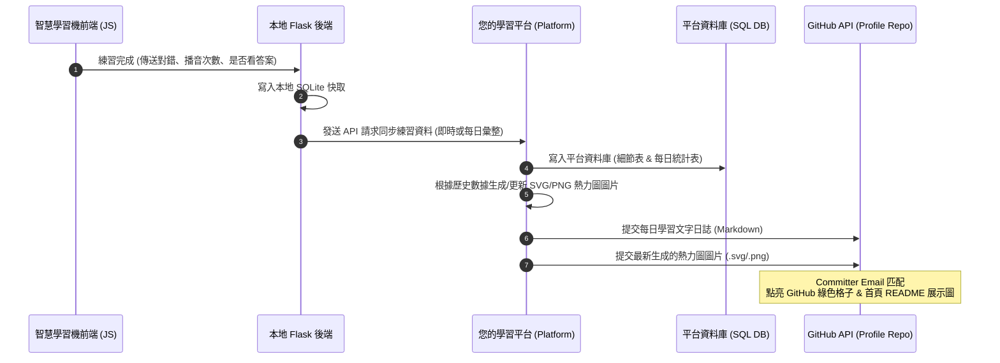

# 智慧學習機與學習平台 API 對接規格書 (API Integration & GitHub Profile Sync Specification)

本文件旨在提供給**學習平台端（Platform）的開發工程師**，以利實作接收本地「智慧學習機（Smart English & Vietnamese Trainer）」的上傳數據，並完成與使用者 GitHub Profile 帳號的連動（包含點亮綠格子、每日學習日誌更新、以及動態熱力圖圖片產生並推送至 GitHub 個人首頁）。

---

## 1. 系統對接架構與目標 (System Architecture & Goals)

我們的目標是實現「本地練習，平台存檔，GitHub 展示」的閉環。完整流程如下：



### 核心功能需求：
1. **學習歷史同步**：本地學習機在作答完成後，即時發送練習記錄至平台，平台予以持久化。
2. **GitHub 綠格子點亮**：平台代調用 GitHub API，以使用者的 GitHub Email 作為 Committer 提交代碼，從而著色首頁貢獻圖。
3. **每日學習日誌**：平台將每日練習詳情以文字追加（Append）形式寫入使用者的 GitHub 專案檔案中（例如 `logs/study_history.md`）。
4. **首頁熱力圖圖片展示**：平台根據使用者近 6 個月的練習數據，自動生成一張熱力圖圖片（推薦 SVG 格式），推送至使用者的 GitHub Profile 倉庫。使用者可以在個人首頁 `README.md` 中引流該圖片，達成「GitHub 首頁動態展示學習進度」的效果。

---

## 2. 平台端資料庫設計 (Platform Database Schema)

為了有效地統計數據、產生日誌與繪製熱力圖，平台端必須建立兩張核心表：**練習細節日誌表** 與 **每日學習統計表**。

### 2.1 練習細節日誌表 (`user_practice_logs`)
儲存使用者每次點擊、作答的原始數據，用於日誌明細與追蹤。

```sql
CREATE TABLE user_practice_logs (
    id BIGINT AUTO_INCREMENT PRIMARY KEY,
    user_id INT NOT NULL,                      -- 平台用戶 ID
    sentence_id INT NOT NULL,                  -- 本地學習機題目原始 ID
    language VARCHAR(10) NOT NULL DEFAULT 'en',-- 語言類型：'en' (英文), 'vi' (越文)
    sentence_text TEXT NOT NULL,               -- 英/越文原文
    chinese_translation TEXT,                  -- 中文對照翻譯
    is_correct TINYINT(1) NOT NULL DEFAULT 1,  -- 本次作答是否正確 (1=正確, 0=錯誤)
    audio_play_count INT NOT NULL DEFAULT 0,    -- 作答期間播音次數
    revealed_answer TINYINT(1) NOT NULL DEFAULT 0, -- 是否曾點擊「顯示答案」 (1=是, 0=否)
    created_at TIMESTAMP DEFAULT CURRENT_TIMESTAMP,
    INDEX idx_user_lang_date (user_id, language, created_at)
) ENGINE=InnoDB DEFAULT CHARSET=utf8mb4;
```

### 2.2 每日學習統計表 (`user_daily_study_summaries`)
按日、按語系聚合統計，這是繪製熱力圖、統計 streak 以及進行每日結算的數據源頭。

```sql
CREATE TABLE user_daily_study_summaries (
    id BIGINT AUTO_INCREMENT PRIMARY KEY,
    user_id INT NOT NULL,
    study_date DATE NOT NULL,                  -- 學習日期 (YYYY-MM-DD)
    language VARCHAR(10) NOT NULL DEFAULT 'en',-- 'en' 或 'vi'
    total_attempts INT NOT NULL DEFAULT 0,     -- 當日練習總次數
    correct_attempts INT NOT NULL DEFAULT 0,   -- 當日答對總次數
    audio_plays INT NOT NULL DEFAULT 0,        -- 當日播音總次數
    reveals INT NOT NULL DEFAULT 0,            -- 當日查看答案總次數
    updated_at TIMESTAMP DEFAULT CURRENT_TIMESTAMP ON UPDATE CURRENT_TIMESTAMP,
    UNIQUE KEY ukey_user_date_lang (user_id, study_date, language),
    INDEX idx_user_date (user_id, study_date)
) ENGINE=InnoDB DEFAULT CHARSET=utf8mb4;
```

---

## 3. API 規格說明 (API Specifications)

本地學習機後端會調用平台端提供的以下 API。

### 3.1 📥 提交單次練習記錄 (Log Practice Attempt)
* **接口路徑 (URL)**: `/api/v1/study/log`
* **請求方法 (Method)**: `POST`
* **安全性驗證 (Headers)**:
  * `Content-Type: application/json`
  * `Authorization: Bearer <User_Access_Token>` (使用者在學習機端設定的 Token)
* **請求主體 (Payload JSON)**:
  ```json
  {
    "sentence_id": 402,
    "language": "vi",
    "english": "Chào buổi sáng, bạn khỏe không?",
    "chinese": "早上好，你好嗎？",
    "is_correct": true,
    "audio_play_count": 2,
    "revealed_answer": false
  }
  ```
* **回應主體 (Response JSON - 成功 200/201)**:
  ```json
  {
    "success": true,
    "message": "Practice log saved successfully.",
    "data": {
      "log_id": 98213,
      "streak_days": 5
    }
  }
  ```

---

## 4. 熱力圖生成與 GitHub 同步邏輯 (Heatmap & GitHub Sync Logic)

每當平台收到練習記錄，寫入資料庫後，必須**異步 (Asynchronously)** 觸發 GitHub 同步任務。該任務包含以下三個核心步驟：

### 步驟 4.1：動態生成熱力圖圖片
平台應自動拉取使用者最近 6 個月的 `user_daily_study_summaries` 數據，繪製一張類似 GitHub Contribution 網格的圖片。

> [!TIP]
> **最佳實踐：使用 SVG 格式**
> 相比於 PNG 圖片，SVG 是純文字 XML 格式，體積小（僅數 KB）、無限清晰度且易於在後端用簡單的字串拼接產生，無需安裝複雜的 Canvas/Matplotlib 等二進制依賴。

#### SVG 生成結構範例：
後端程式只需用迴圈渲染 `<rect>` 元素，並根據當天的總練習次數（`total_attempts`）動態決定網格的顏色深度（例如：沒有練習為深灰、1-5次為淺青、6-10次為中青、11次以上為亮青）。

```xml
<svg width="720" height="110" viewBox="0 0 720 110" xmlns="http://www.w3.org/2000/svg">
  <style>
    .day { fill: #161b22; }
    .level-1 { fill: #0e4429; }
    .level-2 { fill: #006d32; }
    .level-3 { fill: #26a641; }
    .level-4 { fill: #39d353; }
    .month-text { fill: #8b949e; font-size: 9px; font-family: sans-serif; }
  </style>
  <!-- 月份標題 -->
  <text x="15" y="12" class="month-text">Jan</text>
  <text x="75" y="12" class="month-text">Feb</text>
  <!-- 繪製 53 週 × 7 天 的網格 -->
  <rect x="15" y="20" width="10" height="10" rx="2" class="day level-3" />
  <rect x="15" y="32" width="10" height="10" rx="2" class="day level-1" />
  <!-- ... 更多網格 ... -->
</svg>
```

### 步驟 4.2：追加寫入文字學習日誌
準備好要推送到使用者 GitHub 的文字內容。格式建議為簡潔的 Markdown。
例如：追加一條記錄到 `logs/study_history.md`：
```markdown
* 2026-07-12: 練習越文 12 次, 答對 10 次, 播放音檔 15 次, 偷看答案 0 次。
  - Chào buổi sáng (早上好) [答對] [播音 2 次]
  - Chào anh (你好哥) [答錯] [播音 3 次] [曾顯示答案]
```

### 步驟 4.3：呼叫 GitHub API 更新檔案與圖片
平台必須使用該使用者的 **GitHub Personal Access Token (PAT)** 呼叫 API，更新使用者 Profile 專案（通常為 `github.com/{username}/{username}`）中的檔案。

1. **獲取檔案的最新 SHA** (更新文件前必須獲取最新 SHA 防止衝突)：
   * **API**: `GET /repos/{owner}/{repo}/contents/{path}`
2. **寫入並 Commit (同時更新日誌與熱力圖圖片)**：
   * **API**: `PUT /repos/{owner}/{repo}/contents/{path}`
   * **Headers**:
     * `Authorization: token <USER_GITHUB_PAT>`
     * `Accept: application/vnd.github.v3+json`
   * **請求體 (Payload)**:
     ```json
     {
       "message": "Update Study Heatmap & Log - 2026-07-12",
       "content": "<Base64_Encoded_Updated_File_Content>",
       "sha": "<File_SHA_From_Previous_Step>",
       "committer": {
         "name": "<User_Github_Name>",
         "email": "<User_Github_Email>" 
       }
     }
     ```
     > [!IMPORTANT]
     > **綠格子生效關鍵**
     > `"committer"` 中的 `"email"` **必須**與該使用者的 GitHub 主要登入 Email 完全一致。如果使用其他 Email，提交雖然會成功，但 GitHub 綠色格子將**無法著色**。

---

## 5. 使用者 GitHub Profile 展示設定 (User README Configuration)

完成對接後，使用者的 GitHub 首頁 README.md 僅需加入以下兩行 Markdown，即可動態展現平台自動生成的成果：

```markdown
### 📊 我的每日學習狀態 (Daily Study Status)

<!-- 展示平台自動生成並推送的 SVG 熱力圖 -->


<!-- 連結至每日文字學習日誌 -->
[查看詳細每日學習日誌 (Detailed Study History)](./logs/study_history.md)
```

---

## 6. 調試與安全性建議 (Development & Security Guide)

1. **Token 安全**：使用者的 `GITHUB_PAT` 屬於極敏感資訊，平台端資料庫儲存時**必須加密儲存 (AES-256)**，絕不可明文存放。
2. **異步任務隊列 (Queue)**：為防止本地學習機在發送請求時，因平台呼叫 GitHub API 造成請求超時 (Timeout)，平台接收端點應採用「先回應成功，再將 GitHub 圖片繪製與提交任務送入 **Background Workers** (如 Celery, BullMQ 或簡單的 ThreadPool)」的非同步架構。
3. **錯誤補發機制**：若 GitHub API 發生 rate limit 或暫時性伺服器故障，平台應具備重試佇列，避免使用者當天的努力因網路波動而漏記。
