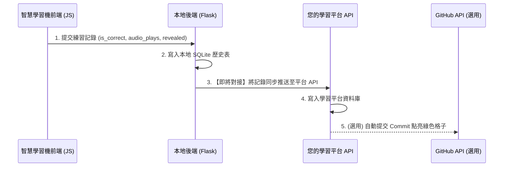

# 智慧學習機與學習平台 API 對接規格書 (API Integration Specification)

本文件旨在提供給**學習平台端**的 AI 助手，以利快速在您的學習平台上實作接收 API，並完成與「Smart English & Vietnamese Trainer（智慧學習機）」的對接。

---

## 1. 對接架構概述 (Overview)

當使用者在「智慧學習機」前端完成一次拼寫或重組練習時，前端會立即向後端發送一個學習記錄請求。
目前第一步是讓您在**學習平台**上，實作一個接收此記錄的 API端點，將數據寫入平台的資料庫，並可選擇性觸發 GitHub Commits 推送。



---

## 2. API 端點規格 (API Endpoint Specification)

請在您的學習平台上實作以下接收端點：

### 📥 記錄學習行為 (Log Practice Attempt)
* **端點路徑 (URL)**: `/api/practice/log`
* **請求方法 (Method)**: `POST`
* **請求標頭 (Headers)**:
  * `Content-Type: application/json`
  * `Authorization: Bearer <Your_Token>` (若平台有驗證機制)
* **請求主體 (Payload JSON)**:
  ```json
  {
    "sentence_id": 125,
    "is_correct": true,
    "audio_play_count": 3,
    "revealed_answer": false,
    "language": "vi",
    "english": "Chào anh, anh lên tầng mấy?",
    "chinese": "你好（哥），你上幾樓？"
  }
  ```

#### 欄位定義說明：
| 欄位名 | 型態 | 必填 | 說明 |
| :--- | :--- | :--- | :--- |
| `sentence_id` | Integer | 是 | 題目在學習機端的原始 ID |
| `is_correct` | Boolean | 是 | 本次回答是否正確（答對為 `true`，答錯為 `false`） |
| `audio_play_count` | Integer | 是 | 本次作答期間，使用者播放語音的次數（包含自動與手動） |
| `revealed_answer` | Boolean | 是 | 本次作答期間，使用者是否曾點擊「顯示答案」偷看答案 |
| `language` | String | 否 | 語系代碼 (`"en"`: 英文, `"vi"`: 越文) |
| `english` | String | 否 | 練習的英/越文句子原文（方便平台直接記錄，不需比對 ID） |
| `chinese` | String | 否 | 練習的中文翻譯 |

---

## 3. 學習平台端資料庫設計建議 (Database Schema)

建議在您的學習平台資料庫中，建立以下結構的表來儲存記錄：

### 表名：`user_practice_logs`
```sql
CREATE TABLE user_practice_logs (
    id INT AUTO_INCREMENT PRIMARY KEY,
    user_id INT NOT NULL,                  -- 使用者 ID
    sentence_text TEXT NOT NULL,           -- 英/越文原文
    chinese_translation TEXT,              -- 中文對照
    language VARCHAR(10) DEFAULT 'en',     -- 'en' 或 'vi'
    is_correct TINYINT(1) DEFAULT 1,       -- 1 = 對, 0 = 錯
    audio_play_count INT DEFAULT 0,        -- 播放次數
    revealed_answer TINYINT(1) DEFAULT 0,  -- 是否看過答案
    practiced_at TIMESTAMP DEFAULT CURRENT_TIMESTAMP
);
```

---

## 4. 自動同步至 GitHub 點亮綠格子的邏輯 (GitHub Sync Guide)

如果您希望學習平台在收到記錄時，自動幫使用者點亮 GitHub 綠色格子（方案 A），請在平台後端實作以下邏輯：

1. **取得 Token**：在平台上儲存該用戶的 GitHub Personal Access Token (PAT) 且有 `repo` 寫入權限。
2. **準備日誌內容**：每當 API 被呼叫時，格式化一行文字，例如：
   `* 2026-07-12: 練習句子 [vi] "Chào anh" - 撥音 3 次, 答對`
3. **呼叫 GitHub API 寫入檔案並 Commit**：
   * **API 路徑**: `PUT /repos/{owner}/{repo}/contents/{path}`
   * **Payload**:
     ```json
     {
       "message": "Study Log: 2026-07-12",
       "content": "<Base64_Encoded_Updated_File_Content>",
       "sha": "<Current_File_SHA>",
       "committer": {
         "name": "Your Name",
         "email": "your-github-email@example.com"
       }
     }
     ```
   * **注意**：Committer 的 Email **必須**與使用者的 GitHub 帳號主要 Email 一致，GitHub 首頁的日曆才會著色。
